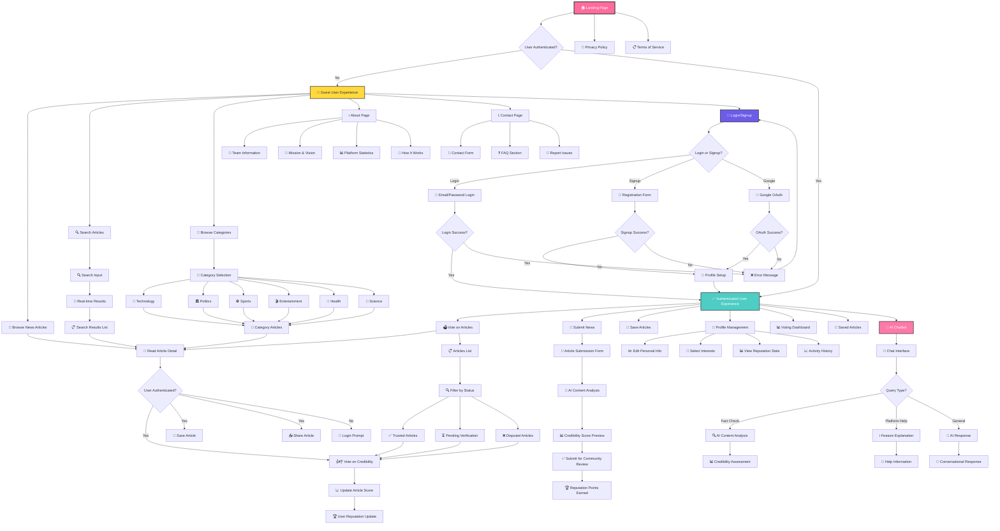
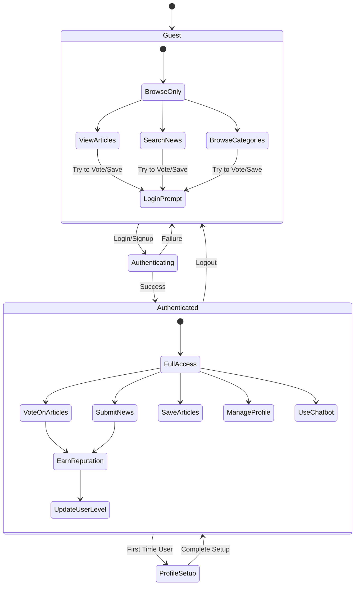
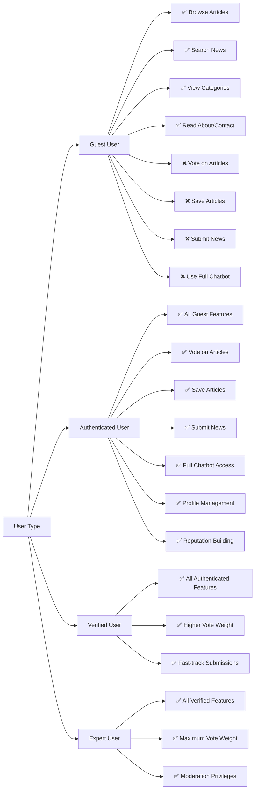
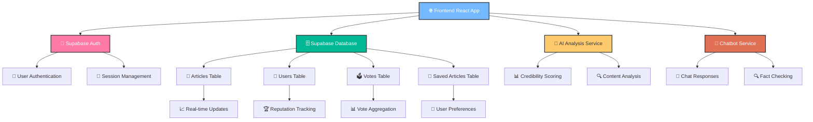
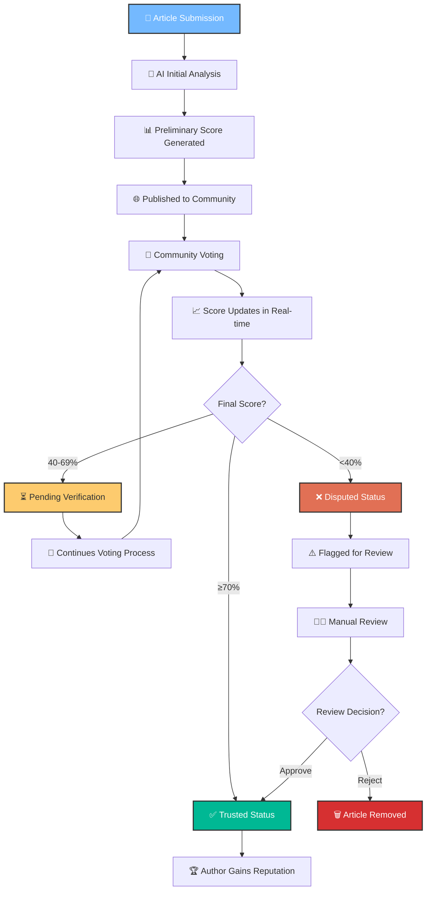
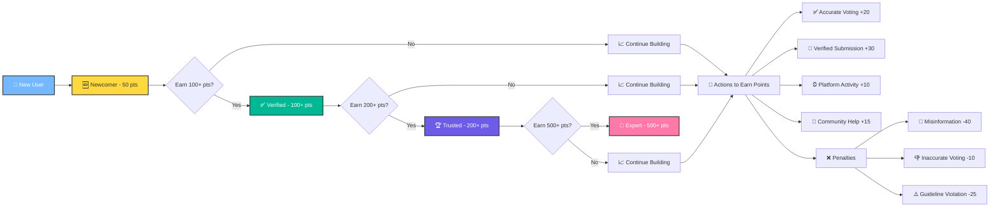

# ZipTales Website Flowchart

## 🌐 **Main User Flow Diagram**

## 🔄 **Authentication State Flow**

## 🎯 **Feature Access Matrix**

## 📊 **Data Flow Architecture**

## 🔄 **Article Lifecycle**

## 🎮 **User Reputation System**

---

## 📋 **Key Features Summary**

### 🔐 **Authentication Features:**
- Email/Password Login & Signup
- Google OAuth Integration
- Profile Setup for New Users
- Session Management

### 📰 **Content Features:**
- Browse Articles by Category
- Real-time Search with Suggestions
- Article Detail Views
- Community Voting System
- Save/Bookmark Articles

### 🤖 **AI Features:**
- Automated Content Analysis
- Credibility Scoring
- Intelligent Chatbot
- Fact-checking Assistance

### 👥 **Community Features:**
- User Reputation System
- Community Voting
- News Submission
- Profile Management

### 📊 **Analytics Features:**
- Real-time Score Updates
- User Activity Tracking
- Platform Statistics
- Reputation Metrics

This flowchart represents the complete user journey and technical architecture of the ZipTales platform, showing how users interact with the system from initial visit to becoming expert community members.